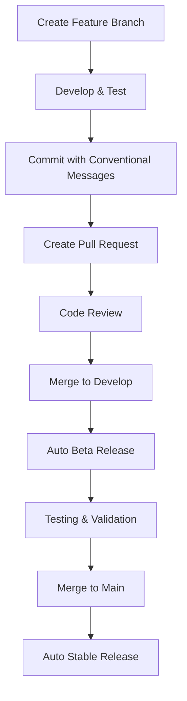

# TSpec Publishing & Release Management Guide

This document outlines the complete setup and workflow for publishing TSpec packages to npm with automated versioning, changelog generation, and multi-channel releases.

## Overview

TSpec uses a **fully automated** publishing system with:
- 🤖 **Automated releases** triggered by merging to main
- 📦 **Synchronized versioning** across all packages
- 📝 **Automatic changelog** generation from commits
- 🎯 **Multiple release channels** (alpha, beta, latest)
- ✅ **Dry-run testing** to prevent broken releases
- 🔒 **Professional security** and access management

## Initial Setup

### 1. npm Organization Setup

First, create an npm organization for TSpec packages:

```bash
# Create npm organization
npm login
npm org:create tspec

# Verify organization
npm org:ls tspec
```

### 2. Package Scoping

All TSpec packages use the `@tspec` scope:
- `@tspec/core` - Core testing framework
- `@tspec/assert` - Assertion library  
- `@tspec/mock` - Mocking utilities
- `@tspec/cli` - Command-line interface

### 3. npm Access Tokens

Create automation tokens for CI/CD:

```bash
# Create automation token (never expires)
npm token create --type=automation --read-and-publish

# Save token securely - you'll need this for GitHub Actions
```

Store this token as `NPM_TOKEN` in GitHub repository secrets.

### 4. GitHub Repository Setup

Configure repository settings:

```bash
# Repository Settings → Secrets and Variables → Actions
NPM_TOKEN=your_npm_automation_token

# Repository Settings → General → Features
☑️ Issues
☑️ Wiki  
☑️ Discussions
☑️ Projects

# Repository Settings → Branches
Branch protection rules for 'main':
☑️ Require a pull request before merging
☑️ Require status checks to pass before merging
☑️ Require conversation resolution before merging
☑️ Do not allow bypassing the above settings
```

## Branch Strategy & Release Channels

### Branch Structure

```
main                    → latest (stable releases)
├── develop            → beta (beta releases)  
├── feature/xyz        → (development branches)
├── hotfix/xyz         → (urgent fixes)
└── release/x.y.z      → (release preparation)
```

### Release Channels

| Branch | npm Tag | Purpose | Auto-publish |
|--------|---------|---------|--------------|
| `main` | `latest` | Stable releases | ✅ Yes |
| `develop` | `beta` | Beta testing | ✅ Yes |
| `feature/*` | `alpha-{sha}` | Development | ⚠️ Manual only |

### Version Strategy

All packages maintain **synchronized versions**:
- When any package changes, ALL packages get the new version
- Follows semantic versioning strictly
- Automatic version bumping based on conventional commits

## Conventional Commits & Versioning

### Commit Message Format

```
type(scope): description

[optional body]

[optional footer]
```

### Commit Types & Version Impact

| Type | Version Bump | Description |
|------|--------------|-------------|
| `feat` | **MINOR** | New features |
| `fix` | **PATCH** | Bug fixes |
| `perf` | **PATCH** | Performance improvements |
| `refactor` | **PATCH** | Code refactoring |
| `docs` | **PATCH** | Documentation only |
| `test` | **PATCH** | Adding tests |
| `chore` | **PATCH** | Maintenance tasks |
| `ci` | **PATCH** | CI/CD changes |
| `BREAKING CHANGE:` | **MAJOR** | Breaking changes (in footer) |

### Examples

```bash
# Patch version bump (0.1.0 → 0.1.1)
git commit -m "fix(assert): resolve floating point comparison issue"

# Minor version bump (0.1.1 → 0.2.0)  
git commit -m "feat(mock): add support for async function mocking"

# Major version bump (0.2.0 → 1.0.0)
git commit -m "feat(core): redesign test discovery API

BREAKING CHANGE: findTestFiles now returns Promise<TestFile[]> instead of string[]"
```

## Automated Release Workflow

### 1. Development Process



### 2. GitHub Actions Workflow

Create `.github/workflows/release.yml`:

```yaml
name: Release

on:
  push:
    branches: [main, develop]
  pull_request:
    branches: [main]

jobs:
  test:
    runs-on: ubuntu-latest
    steps:
      - uses: actions/checkout@v4
      - uses: actions/setup-node@v4
        with:
          node-version: 18
          cache: 'npm'
      
      - name: Install dependencies
        run: npm ci
      
      - name: Build packages
        run: npm run build
      
      - name: Run tests
        run: npm test
      
      - name: Type check
        run: npm run typecheck

  release:
    needs: test
    runs-on: ubuntu-latest
    if: github.event_name == 'push'
    steps:
      - uses: actions/checkout@v4
        with:
          fetch-depth: 0
          token: ${{ secrets.GITHUB_TOKEN }}
      
      - uses: actions/setup-node@v4
        with:
          node-version: 18
          cache: 'npm'
          registry-url: 'https://registry.npmjs.org'
      
      - name: Install dependencies
        run: npm ci
      
      - name: Build packages
        run: npm run build
      
      - name: Release
        env:
          GITHUB_TOKEN: ${{ secrets.GITHUB_TOKEN }}
          NPM_TOKEN: ${{ secrets.NPM_TOKEN }}
          NODE_AUTH_TOKEN: ${{ secrets.NPM_TOKEN }}
        run: npm run release
```

### 3. Release Automation Scripts

Add to root `package.json`:

```json
{
  "scripts": {
    "release": "semantic-release",
    "release:dry": "semantic-release --dry-run",
    "version:packages": "node scripts/sync-versions.js"
  },
  "devDependencies": {
    "@semantic-release/changelog": "^6.0.3",
    "@semantic-release/git": "^10.0.1",
    "@semantic-release/github": "^9.2.0",
    "@semantic-release/npm": "^11.0.0",
    "semantic-release": "^22.0.0",
    "semantic-release-monorepo": "^8.0.0"
  }
}
```

### 4. Semantic Release Configuration

Create `.releaserc.json`:

```json
{
  "branches": [
    "+([0-9])?(.{+([0-9]),x}).x",
    "main",
    {
      "name": "develop",
      "prerelease": "beta"
    },
    {
      "name": "alpha",
      "prerelease": true
    }
  ],
  "plugins": [
    "@semantic-release/commit-analyzer",
    "@semantic-release/release-notes-generator",
    "@semantic-release/changelog",
    ["@semantic-release/npm", {
      "pkgRoot": "packages/core"
    }],
    ["@semantic-release/npm", {
      "pkgRoot": "packages/assert"
    }],
    ["@semantic-release/npm", {
      "pkgRoot": "packages/mock"
    }],
    ["@semantic-release/npm", {
      "pkgRoot": "packages/cli"
    }],
    ["@semantic-release/git", {
      "assets": [
        "CHANGELOG.md",
        "package.json",
        "packages/*/package.json"
      ],
      "message": "chore(release): ${nextRelease.version} [skip ci]\n\n${nextRelease.notes}"
    }],
    "@semantic-release/github"
  ]
}
```

### 5. Version Synchronization Script

Create `scripts/sync-versions.js`:

```javascript
#!/usr/bin/env node

const fs = require('fs');
const path = require('path');

function updatePackageVersion(packagePath, version) {
  const pkgPath = path.join(packagePath, 'package.json');
  const pkg = JSON.parse(fs.readFileSync(pkgPath, 'utf8'));
  
  pkg.version = version;
  
  // Update internal dependencies
  if (pkg.dependencies) {
    Object.keys(pkg.dependencies).forEach(dep => {
      if (dep.startsWith('@tspec/')) {
        pkg.dependencies[dep] = `^${version}`;
      }
    });
  }
  
  fs.writeFileSync(pkgPath, JSON.stringify(pkg, null, 2) + '\n');
  console.log(`Updated ${packagePath} to version ${version}`);
}

function syncVersions() {
  const rootPkg = JSON.parse(fs.readFileSync('package.json', 'utf8'));
  const version = rootPkg.version;
  
  const packages = [
    'packages/core',
    'packages/assert', 
    'packages/mock',
    'packages/cli'
  ];
  
  packages.forEach(pkg => updatePackageVersion(pkg, version));
}

if (require.main === module) {
  syncVersions();
}

module.exports = { syncVersions, updatePackageVersion };
```

Make it executable:
```bash
chmod +x scripts/sync-versions.js
```

## Release Process

### 1. Development Workflow

```bash
# 1. Create feature branch
git checkout -b feature/new-assertion-methods

# 2. Make changes with conventional commits
git commit -m "feat(assert): add toBeInstanceOf assertion method"
git commit -m "test(assert): add tests for toBeInstanceOf"
git commit -m "docs(assert): document toBeInstanceOf method"

# 3. Push and create PR
git push origin feature/new-assertion-methods
# Create PR to 'develop' branch

# 4. After review, merge to develop
# → Triggers automatic beta release (e.g., 0.2.0-beta.1)

# 5. Test beta release, then merge develop to main
# → Triggers automatic stable release (e.g., 0.2.0)
```

### 2. Emergency Hotfix Workflow

```bash
# 1. Create hotfix branch from main
git checkout main
git checkout -b hotfix/critical-bug-fix

# 2. Make fix with conventional commit
git commit -m "fix(core): resolve memory leak in test runner"

# 3. Create PR directly to main
# → After merge, triggers patch release (e.g., 0.1.1)

# 4. Merge main back to develop to sync
git checkout develop
git merge main
```

### 3. Manual Release (Emergency)

```bash
# Dry run first
npm run release:dry

# Manual release
NPM_TOKEN=your_token npm run release
```

## Monitoring & Maintenance

### 1. Release Health Checks

Monitor these metrics after each release:

- **Download stats**: `npm info @tspec/core`
- **GitHub releases**: Check release notes accuracy
- **Issues**: Monitor for new bug reports
- **Documentation**: Verify docs are up to date

### 2. Regular Maintenance

**Weekly:**
- Review dependency updates
- Check security advisories
- Monitor package download trends

**Monthly:**
- Review and update documentation
- Audit npm access permissions
- Check automated workflow health

**Quarterly:**
- Review release process effectiveness
- Update CI/CD configurations
- Plan breaking changes for next major version

### 3. Security Best Practices

```bash
# Enable 2FA on npm account
npm profile enable-2fa auth-and-writes

# Regular security audit
npm audit
npm audit fix

# Monitor for security issues
npm install -g npm-check-updates
ncu -u
```

## Emergency Procedures

### 1. Unpublishing a Bad Release

```bash
# Within 24 hours of publish (npm policy)
npm unpublish @tspec/core@1.2.3

# After 24 hours, deprecate instead
npm deprecate @tspec/core@1.2.3 "This version has critical bugs. Please upgrade to 1.2.4+"
```

### 2. Fixing Broken CI/CD

```bash
# Skip CI for emergency commits
git commit -m "fix: emergency hotfix [skip ci]"

# Re-run failed workflows
# Use GitHub UI: Actions → Failed workflow → Re-run jobs
```

### 3. Rolling Back

```bash
# Revert merge commit
git revert -m 1 <merge-commit-hash>

# Create emergency patch release
git commit -m "fix: revert breaking changes from v1.2.0

BREAKING CHANGE: This reverts the breaking API changes introduced in v1.2.0"
```

## Package-Specific Considerations

### @tspec/core
- **Most critical** - breaking changes here affect everything
- Requires extensive testing before release
- Document migration guides for major versions

### @tspec/cli  
- **User-facing** - breaking changes affect developer workflow
- Maintain backward compatibility when possible
- Consider deprecation warnings before breaking changes

### @tspec/assert & @tspec/mock
- **API stability** - users depend on consistent assertion/mock APIs
- Additions are safe, changes need careful consideration
- Performance improvements are always welcome

## Future Enhancements

### Multi-Maintainer Support

When adding maintainers:

```bash
# Add to npm organization
npm org:set tspec <username> developer

# Add to GitHub repository
# Settings → Collaborators → Add people
```

### Advanced Automation

Consider adding:
- **Performance regression testing** in CI
- **Bundle size monitoring** with size-limit
- **Automated dependency updates** with Dependabot
- **Release announcement** automation (Discord, Twitter)

### Publishing Analytics

Set up monitoring for:
- Package download metrics
- Version adoption rates  
- Geographic usage patterns
- Popular feature usage

---

## Quick Reference

### Essential Commands

```bash
# Test release process (dry run)
npm run release:dry

# Sync all package versions
npm run version:packages

# Check what would be released
npx semantic-release --dry-run

# Manual emergency release
NPM_TOKEN=token npm run release
```

### Commit Templates

```bash
# Feature
feat(scope): add new functionality

# Bug fix  
fix(scope): resolve issue with X

# Breaking change
feat(scope): redesign API

BREAKING CHANGE: method signatures have changed
```

### Troubleshooting

| Problem | Solution |
|---------|----------|
| Release failed | Check GitHub Actions logs, verify npm token |
| Wrong version bumped | Review commit message conventions |
| Package not published | Verify package.json `publishConfig` |
| CI/CD hanging | Check for missing environment variables |

This publishing system will give TSpec a professional, automated release workflow that scales as the project grows! 🚀 